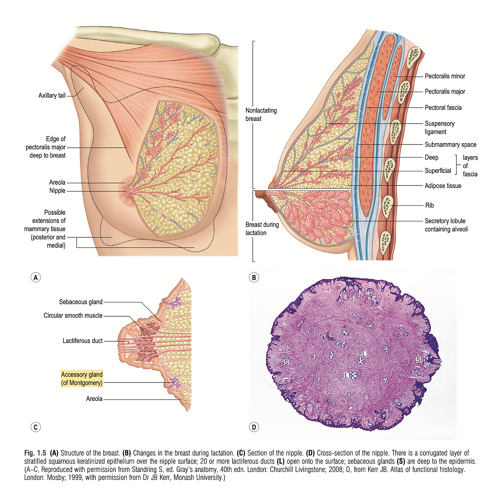

# Breast Reduction

## Introduction
Breast reduction surgery, medically known as reduction mammoplasty, is a procedure designed to alleviate the physical and psychological discomfort associated with disproportionately large breasts. This surgical intervention not only aims to reduce the size of the breasts but also to reshape them to ensure symmetry and enhance the overall aesthetic appeal.

### The Need for Breast Reduction
Individuals with overly large breasts may experience a variety of health issues, including back and neck pain, skin irritation beneath the breast crease, and even breathing difficulties. Moreover, the psychological impact, such as self-consciousness and limited physical activity, can significantly affect one's quality of life. Breast reduction surgery offers a solution to these challenges, aiming to improve physical health, boost self-esteem, and expand lifestyle choices.

### Procedure
Breast reduction surgery involves the removal of excess breast fat, glandular tissue, and skin to achieve a breast size in proportion with the body. The procedure typically includes:

- **Anesthesia**: Administered for the patient's comfort during the surgical procedures.
- **Incision**: There are several incision techniques, including the circular pattern around the areola, the keyhole (or racquet-shaped) pattern with an incision around the areola and vertically down to the breast crease, and the inverted T or anchor-shaped pattern.
- **Removal and Reshaping**: Excess tissue is removed, and the remaining breast tissue is lifted and reshaped to improve breast contour and firmness. The nipple and areola are also repositioned to a natural, more youthful height.
- **Closing the Incisions**: Incisions are closed with sutures, skin adhesives, or surgical tape, leaving scars that will significantly fade over time.

### Recovery and Outcomes
Post-surgery, patients are provided with guidelines on care, including dressings or bandages and a support bra to minimize swelling and support the breasts as they heal. Recovery time varies, with many patients returning to work and normal activities within a few weeks, albeit with some limitations on physical exertion.

The outcomes of breast reduction surgery are visible immediately and continue to improve as swelling subsides and incision lines fade. The vast majority of patients express satisfaction not only with the physical appearance but also with the relief from the discomfort and limitations previously experienced.

## Relevant Anatomy
{: style="width:150px" align=right loading=lazy}
Understanding the anatomy of the breast is fundamental for performing breast reduction surgery. This knowledge ensures the surgeon can make precise incisions, remove the appropriate amount of tissue, and reshape the breast while preserving function and sensation. 

Here are the key anatomical components relevant to breast reduction:

- **Skin and Subcutaneous Tissue**: The breast skin envelope varies in thickness and elasticity, which can affect surgical outcomes and scar healing. The subcutaneous layer contains fat that contributes to the breast's size and shape.
- **Breast Glandular Tissue**: This is the functional part of the breast, composed of lobes and lobules that produce milk. The distribution and density of glandular tissue vary among individuals and can influence the technique used for tissue removal.
- **Cooper's Ligaments**: These fibrous bands provide support to the breast tissue, maintaining its shape and position. Preserving these ligaments during surgery is important for achieving a natural-looking breast contour post-reduction.
- **Blood Supply**: The breasts are vascularized primarily by the internal mammary artery, lateral thoracic artery, and intercostal arteries. Knowledge of these vascular networks is critical to avoid excessive bleeding and ensure the viability of the nipple-areola complex after surgery.
- **Lymphatic Drainage**: Lymph nodes located in the axillary (armpit) area are responsible for draining lymph fluids from the breasts. Surgeons must be cautious not to disrupt these pathways significantly to prevent postoperative complications, such as lymphedema.
- **Nerves**: The sensation in the breast, particularly in the nipple and areola, is primarily provided by the fourth intercostal nerve. Preserving nerve function is crucial for maintaining nipple sensation after surgery. Awareness of the nerve paths is essential to avoid inadvertent damage.
- **Nipple-Areola Complex (NAC)**: This is a critical aesthetic and functional component of the breast. The position, size, and viability of the NAC are key considerations in breast reduction surgery. The surgeon must carefully plan the new location of the NAC to ensure a natural appearance and preserve its sensory and erectile functions.
- **Chest Wall and Musculature**: The pectoralis major muscle underlies the breast tissue and is an important landmark for determining the extent of tissue removal and the technique used. The relationship between the breast and the chest wall affects the final breast shape and projection.

## Work-up
A comprehensive work-up for breast reduction surgery is essential to assess the patient's eligibility, prepare for the procedure, and ensure optimal outcomes. This work-up generally involves the following components:

### Medical History and Physical Examination
- Purpose: To understand the patient's overall health, previous surgeries, current medications, allergies, and any history of breast cancer or breast diseases.
- Physical Examination: Evaluate the breasts for size, symmetry, skin quality, and nipple-areola complex position. This helps in determining the surgical approach and identifying any potential challenges.

### Diagnostic Imaging
- Mammography or Breast Ultrasound: Recommended especially for patients over a certain age (usually 40 and above) or those with a significant family history of breast cancer. These imaging studies provide detailed information about the breast tissue, helping to identify any abnormalities that might influence the surgical plan.

### Laboratory Tests
- Routine preoperative tests such as a complete blood count (CBC), coagulation profile, and any other tests deemed necessary based on the patient’s medical history. These tests assess the patient's readiness for surgery and ability to heal postoperatively.

### Photographic Documentation
- Photos are taken from multiple angles for medical records, surgical planning, and as a reference for both the surgical team and the patient. These photographs are also crucial for insurance documentation, demonstrating the physical symptoms caused by the breast size.

### Assessment of Psychological and Physical Impact
- Understanding the impact of macromastia (large breasts) on the patient's life, including physical discomfort, limitations on activities, and psychological distress, is crucial. This assessment supports the medical necessity of the procedure, especially for insurance coverage.

### Risk Factor Evaluation
- Identifying and managing risk factors such as smoking, obesity, diabetes, or hypertension is essential to minimize surgical and postoperative complications.

### Review of Medications
- Assess current medications, including over-the-counter drugs and supplements, to identify any that might increase the risk of bleeding or interfere with anesthesia.

### Insurance Preauthorization (if applicable)
- Gathering all necessary documentation to submit for insurance preauthorization. This typically includes a detailed letter from the surgeon outlining the medical necessity of the procedure, photographic evidence, and records of previous conservative management (e.g., physical therapy, orthopedic consultations).

## Pre-operative counseling
Pre-operative counseling is a critical component of the surgical process, especially for breast reduction surgery. It provides patients with essential information, sets realistic expectations, and prepares them mentally and physically for the surgery and recovery period. Here's a detailed overview of what pre-operative counseling for breast reduction surgery should cover:

### Understanding the Procedure
- Surgical Goals: Clarify what breast reduction surgery can achieve in terms of breast size, shape, and overall appearance. Discuss how it can alleviate physical discomfort and improve quality of life.
- Surgical Techniques: Explain the different surgical techniques available, including the incision patterns and their implications for scarring, and how the technique will be chosen based on the patient's specific anatomy and goals.
- Potential Outcomes: Provide a realistic overview of what to expect in terms of outcomes, including the potential for improved symmetry, reduced pain, and increased ability to engage in physical activities.

### Managing Expectations
- Aesthetic Outcomes: Discuss the realistic aesthetic outcomes, including potential limitations. Emphasize that perfect symmetry is not always achievable and that minor differences between the breasts may remain.
- Scarring: Explain the location and extent of possible scarring, and discuss scar management strategies.
- Sensory Changes: Inform the patient about the potential for changes in nipple sensation or temporary numbness in the breast area.

### Preparing for Surgery
- Preoperative Instructions: Provide specific instructions regarding medications, fasting, and other preparations for surgery. This includes guidelines on smoking cessation, as smoking can affect the healing process.
- Recovery Expectations: Outline the typical recovery timeline, including when to expect to return to work, engage in physical activity, and see the final results of the surgery.
- Support System: Stress the importance of having a support system in place for assistance during the initial recovery period.

### Risks and Complications
- Common Risks: Discuss common risks associated with breast reduction surgery, such as infection, bleeding, and adverse reactions to anesthesia.
- Long-term Complications: Address potential long-term complications, including issues with breastfeeding, changes in breast sensation, or the need for revision surgery.
- Risk Mitigation: Explain the measures taken to minimize risks and manage any complications should they arise.

### Postoperative Care and Follow-Up
- Immediate Postoperative Care: Describe the care plan immediately following surgery, including dressings, drains (if used), and pain management.
- Follow-Up Visits: Outline the schedule for follow-up visits to monitor the healing process and address any concerns.
- Lifestyle Adjustments: Provide recommendations on lifestyle adjustments to support healing and maintain the results of the surgery, such as maintaining a stable weight and adopting a healthy lifestyle.

### Answering Questions and Concerns
- Open Discussion: Encourage the patient to ask questions and express any concerns they may have about the surgery, recovery, and outcomes. Providing clear, honest answers is key to building trust and ensuring the patient feels supported and informed.

## Markings
Preoperative markings are a critical step in the planning and execution of breast reduction surgery. These markings are made while the patient is in a sitting position, as this allows for the accurate assessment of the breast's natural shape, asymmetries, and how gravity affects the breast tissue. The process involves drawing incision lines, reference points, and contours on the breast skin with a surgical marker. These markings guide the surgeon during the procedure, ensuring precision in tissue removal, nipple-areola complex positioning, and achieving symmetrical and aesthetically pleasing results.

- Objectives of Preoperative Markings
    - Define Incision Pathways: To outline the areas where incisions will be made, ensuring minimal scarring and optimal access for tissue removal.
    - Establish New Nipple-Areola Position: To mark the new, higher position of the nipple-areola complex that aligns with the patient’s desired breast size and shape.
    - Determine Tissue Removal Zones: To delineate the areas of breast tissue and fat to be removed, aiding in achieving the desired breast volume and contour.
    - Assess Symmetry: To identify and compensate for any pre-existing asymmetries between the breasts, aiming for symmetrical outcomes post-surgery.
- Techniques and Considerations
    - Anchor Pattern (Wise Pattern): A common technique where markings outline an anchor-shaped pattern, suitable for significant reductions and reshaping. This pattern includes a periareolar, vertical, and inframammary fold incision.
    - Vertical (Lollipop) Pattern: For moderate reductions, a vertical or lollipop pattern is marked, involving a periareolar and vertical incision without the inframammary fold incision.
    - Periareolar (Donut) Pattern: Used in cases requiring minimal reduction and lifting. This technique involves a circular incision around the areola.

Marking Procedure

The process starts with marking the midline of the chest and the inframammary fold, ensuring accuracy in the vertical positioning of the breasts.

The new position of the nipple-areola complex is then marked, typically at the level of the inframammary fold or slightly above, depending on the breast's final desired size and the patient's anatomy.

Incision lines are drawn, considering the breast's natural contours and the amount of tissue to be removed. The surgeon must balance the removal of enough tissue to relieve symptoms with maintaining enough tissue for a natural breast shape and adequate blood supply to the nipple.

Patient Involvement and Final Review

Engaging the patient in the marking process ensures that their expectations align with the surgical plan. It also provides an opportunity to discuss the final outcomes and address any last-minute concerns.

A final review of the markings is conducted before surgery, with the patient and surgeon confirming the planned incisions and expected results.

## Operative

Central Mound

The Central Mound technique, also known as the central pedicle technique, is a surgical method used in breast reduction that preserves a significant amount of breast tissue connected to the nipple-areola complex. This method focuses on maintaining the nipple's blood supply and sensation while allowing for significant reduction and reshaping of the breast. It is particularly valued for its versatility and effectiveness in achieving aesthetically pleasing outcomes with good long-term stability.

Procedure

Preoperative Marking:

Preoperative markings are made with the patient in a standing position. The new position for the nipple-areola complex is marked, along with the areas of tissue removal. The central mound that will be preserved is also outlined, ensuring it includes sufficient tissue to maintain blood supply and sensation to the nipple.

Incision:

The incisions are typically made around the areola and then vertically down to the inframammary fold, and horizontally along the fold, resembling an inverted "T" or anchor shape. This allows for access to remove excess breast tissue and skin while preserving the central mound.

Tissue Removal and Reshaping:

Excess fat, glandular tissue, and skin are removed from around the central mound, according to the preoperative markings. The central mound, containing the nipple-areola complex, is then carefully reshaped and repositioned higher on the chest wall to match the new breast contour.

Nipple-areola Complex Repositioning:

The nipple-areola complex remains attached to the central mound of breast tissue, preserving its blood supply and sensation. It is moved to its new position without detaching it, ensuring the viability of the nipple.

Closure:

The incisions are closed in layers to support the newly shaped breast, minimize scarring, and promote a natural breast contour. Drains may be inserted to prevent fluid accumulation, and dressings are applied.

Advantages

Blood Supply Preservation: The central mound technique is effective in preserving the blood supply to the nipple-areola complex, reducing the risk of necrosis.

Sensory Preservation: Maintaining sensation in the nipple-areola complex is a significant advantage of this technique.

Versatility: Suitable for most patients, including those with larger reductions and varying breast shapes.

Aesthetic Outcomes: Allows for excellent control over breast shape and size, providing predictable and aesthetically pleasing results.

Considerations

Surgical Skill: Requires a high level of surgical expertise to precisely reshape and position the central mound.

Scarring: The technique typically involves anchor-shaped scars, which may be a consideration for some patients.

Postoperative Adjustments: Some patients may require minor adjustments postoperatively to refine the breast shape or size.

## Post Operative Care

Immediate Post-Operative Care

Pain Management: Patients will likely experience discomfort and pain immediately following surgery. Prescribed pain medication should be taken as directed to manage this.

Wound Care: Care for the surgical incisions is critical. Initially, dressings or bandages will be applied to the incisions, and instructions on how to care for them at home will be provided. It’s important to keep the area clean and dry.

Drain Management: If drains are placed during surgery to remove excess fluid, instructions on care and emptying will be given. Drains typically remain in place for several days to a week.

Support Garments: A surgical support bra or compression garment is often recommended to reduce swelling and support the new breast contour. It should be worn as instructed.

Monitoring and Follow-Up

Swelling and Bruising: Swelling and bruising are normal and will gradually subside over several weeks. Instructions on using cold compresses or other methods to minimize swelling may be provided.

Activity Restrictions: Patients are advised to avoid strenuous activities, heavy lifting, and overhead movements for a specified period, usually 4-6 weeks, to facilitate healing and prevent strain on the surgical sites.

Follow-Up Visits: Scheduled follow-up appointments are crucial to monitor healing, remove any sutures or drains, and address any concerns. These visits also allow the surgeon to assess the progress of the recovery and the outcome of the surgery.

Long-Term Care and Recovery

Scar Care: Scars from breast reduction surgery will go through several phases of healing. Silicone sheets or scar gels may be recommended to optimize the appearance of scars. Exposure to sunlight should be avoided to prevent darkening of the scars.

Sensation: Changes in breast and nipple sensation are common but usually temporary. Normal sensation may return gradually, but it can take up to a year or longer for full sensation to be restored.

Resuming Activities: A gradual return to normal activities is encouraged. Guidance on when it’s safe to resume exercise and other activities will be provided based on individual recovery progress.

Emotional Support: Emotional fluctuations are common as the body heals and adjusts to the changes in breast size. Support from friends, family, or support groups can be beneficial.

Complication Awareness

Signs of Infection: Patients should be aware of signs of infection, such as increased redness, warmth, worsening pain, or fever, and report these to their surgeon immediately.

Seroma and Hematoma: Accumulation of fluid (seroma) or blood (hematoma) around the surgical site can occur. Prompt medical attention is needed if these conditions are suspected.

## Complications

While breast reduction surgery is generally safe and provides significant benefits, like any major surgery, it comes with potential risks and complications. Understanding these is crucial for informed consent and preparation. Here are the most common complications associated with breast reduction surgery:

Infection: Infections can occur at the incision sites or within the breast tissue. Symptoms may include redness, swelling, warmth, and discharge. Infections are typically treated with antibiotics, but in severe cases, additional surgery may be required.

Bleeding and Hematoma:Some bleeding is expected after surgery, but excessive bleeding may lead to the formation of a hematoma, a collection of blood outside of blood vessels. Hematomas might need to be drained surgically.

Scarring: Scarring is inevitable with breast reduction surgery, though the extent and visibility of scars can vary. Surgeons aim to minimize and strategically place incisions to reduce noticeable scarring. Over time, scars typically fade but may not completely disappear.

Changes in Nipple or Breast Sensation: Temporary or permanent changes in nipple or breast sensation can occur. While many patients experience a return of sensation, some may face reduced or lost sensitivity.

Difficulty Breastfeeding: Breast reduction surgery can affect breastfeeding ability, with some women experiencing reduced milk supply or inability to breastfeed. Discussing future breastfeeding plans with your surgeon beforehand is important.

Asymmetry: Differences in size, shape, or symmetry between the breasts can occur after surgery. While surgeons strive for symmetry, minor differences are possible and may require additional surgery for correction.

Loss of Nipple and Areola: Though rare, it is possible to experience partial or total loss of the nipple and areola due to insufficient blood supply (necrosis). This complication is more common in larger reductions or in patients with certain risk factors, like smoking.

Fat Necrosis: Fat necrosis refers to the death of fat cells in the breast tissue, which can lead to firm lumps and sometimes pain. While these lumps can resolve on their own, some may require removal.

Allergic Reactions: Allergic reactions to anesthesia, surgical materials, or post-operative medications can occur. It’s important to discuss any known allergies with the patient.

Poor Wound Healing: Some patients may experience delayed wound healing due to factors like age, smoking, diabetes, or poor nutritional status. Proper care and follow-up are essential to manage this risk.

## Revisions

While breast reduction surgery often yields significant physical and psychological benefits, some patients may require or desire revision surgery. Revisions can address a range of concerns, from aesthetic adjustments to the correction of complications. Understanding when and why revisions might be necessary can help set realistic expectations and prepare patients for potential outcomes.

Common Reasons for Revision Surgery

Asymmetry Correction: Even with precise planning and execution, postoperative asymmetry between the breasts in terms of size, shape, or nipple position may become apparent once the swelling subsides and the tissues settle.

Size Adjustments: Some patients may feel their breasts are still too large or, conversely, too small after the initial healing period, prompting a desire for further size adjustment.

Improvement of Scarring: Abnormal or hypertrophic scarring may occur despite proper wound care, necessitating surgical revision or treatments like laser therapy to improve the appearance of scars.

Correction of Surgical Complications: Complications such as inadequate healing, infection, or fat necrosis might require surgical intervention to correct and improve the outcome.

Restoration After Pregnancy or Weight Changes: Significant weight fluctuations or pregnancy after breast reduction surgery can alter the results, leading some patients to seek revisions to restore their previous outcomes.

Timing of Revision Surgery

It's crucial to allow sufficient time for healing and for the final results of the initial surgery to stabilize before undergoing revision surgery. This typically means waiting at least 6-12 months, as the breasts continue to change shape and settle during this period.

Considerations and Expectations

Setting Realistic Expectations: It’s important for patients to have realistic expectations about what revision surgery can achieve and to discuss these thoroughly with their surgeon.

Evaluating Risks and Benefits: Like any surgical procedure, revision surgery carries its own set of risks and benefits that should be carefully weighed. Discussion with a qualified surgeon can help in making an informed decision.

Preparation and Recovery: The preparation for and recovery from revision surgery can be similar to the initial procedure, including potential restrictions on activities and the need for supportive garments.

## Special Circumstances

Gigantomastia

Definition and Criteria

Gigantomastia is a condition where individuals experience extreme and often painful enlargement of the breasts, which can be disproportionate to their body size. While there is no strict definition based on breast weight or size, the condition is generally recognized when the breasts cause significant physical symptoms or impair quality of life.

Causes and Risk Factors

The exact cause of gigantomastia is not well-understood, but it's believed to involve hormonal imbalances, genetic predispositions, and possibly certain medications or medical conditions. The condition can occur spontaneously, during puberty, pregnancy, or menopause, indicating a possible link to hormonal changes.

Symptoms and Complications

Physical Discomfort: Severe back, neck, and shoulder pain, as well as skin irritation under the breasts, are common.

Mobility Issues: The excessive weight of the breasts can limit physical activity and function.

Psychosocial Impact: Gigantomastia can lead to significant psychological distress, including body image issues, depression, and social isolation.

Health Concerns: The condition can also cause posture problems, breathing difficulties, and skeletal deformities in severe cases.

Surgical Management

Surgery is often the most effective treatment for gigantomastia, aiming to reduce breast size, alleviate symptoms, and improve the patient's quality of life. The choice of surgical technique depends on the amount of reduction needed, the patient's anatomy, and specific goals for the outcome.

Reduction Mammoplasty: Traditional breast reduction surgery is commonly used, involving the removal of excess breast tissue, fat, and skin. Techniques are tailored to manage the significant volume reduction required in gigantomastia cases, focusing on preserving functionality and achieving a proportional breast size.

Free Nipple Graft: For extreme cases, the free nipple graft technique may be necessary. This involves completely detaching and then reattaching the nipple-areola complex, which may impact nipple sensation and the ability to breastfeed.

Challenges in Treatment

Recurrence: Gigantomastia may recur, especially if it develops during pregnancy or at a young age, necessitating further surgical intervention.

Surgical Risks: Given the extensive nature of the surgery required for gigantomastia, patients may face increased risks of complications, such as loss of nipple sensation, difficulties with wound healing, and significant scarring.

Psychological and Social Support

Addressing the psychosocial impacts of gigantomastia is crucial. Support groups, counseling, and thorough pre-operative consultations can help patients manage the psychological aspects of their condition and the changes that follow surgical treatment.

Re-Reduction

Re-reduction involves performing another breast reduction surgery after an initial procedure. It’s considered when the outcomes of the first surgery have changed over time due to various factors or if the initial results did not meet the patient’s expectations or needs.

Reasons for Re-reduction

Growth of Breast Tissue: Hormonal changes, weight gain, or pregnancy after the initial surgery can lead to increased breast size, necessitating further reduction.

Insufficient Initial Reduction: Some patients may feel that their breasts are still larger than desired and seek further size reduction.

Asymmetry or Aesthetic Concerns: Changes over time or dissatisfaction with the shape, size, or symmetry of the breasts after the initial surgery may lead to consideration of re-reduction.

Physical Symptoms Recur: Return of physical discomfort or symptoms, such as back pain or skin irritation, can prompt discussions about additional surgery.

Challenges and Considerations

Scar Tissue: Previous surgeries can lead to the formation of scar tissue, which may complicate subsequent procedures by affecting healing and outcomes.

Blood Supply: The risk to the nipple-areola complex’s blood supply increases with each subsequent surgery, which can impact nipple sensation and viability.

Surgical Planning: Detailed preoperative planning is crucial to navigate scar tissue, preserve blood supply, and achieve desired outcomes while minimizing risks.

Procedure and Techniques

The approach to re-reduction will depend on the individual’s anatomy, the amount of tissue to be removed, and the presence of scar tissue from the previous surgery. Surgeons may use techniques similar to those in the initial surgery but will tailor their approach based on the unique challenges presented by re-reduction.

Recovery and Outcomes

Recovery from re-reduction may be similar to or slightly longer than the initial breast reduction, depending on the extent of the surgery and the body’s response to a second procedure.

Setting realistic expectations is crucial, as outcomes may be influenced by factors such as skin elasticity, healing capacity, and the presence of scar tissue.